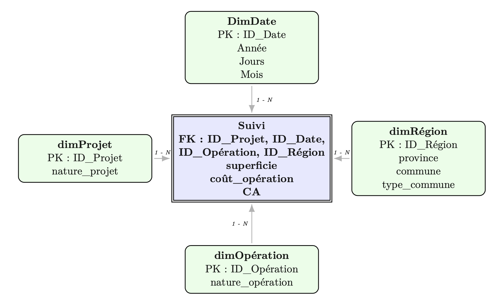
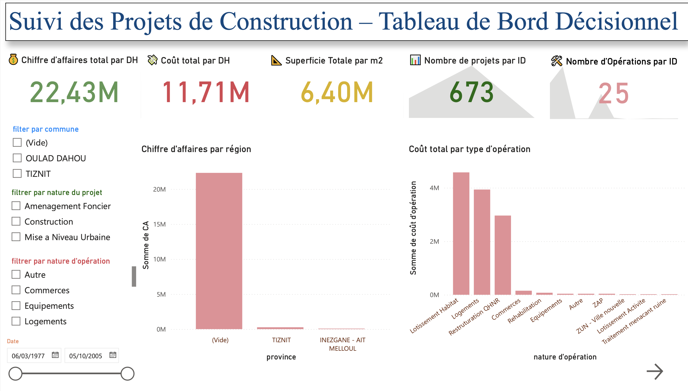
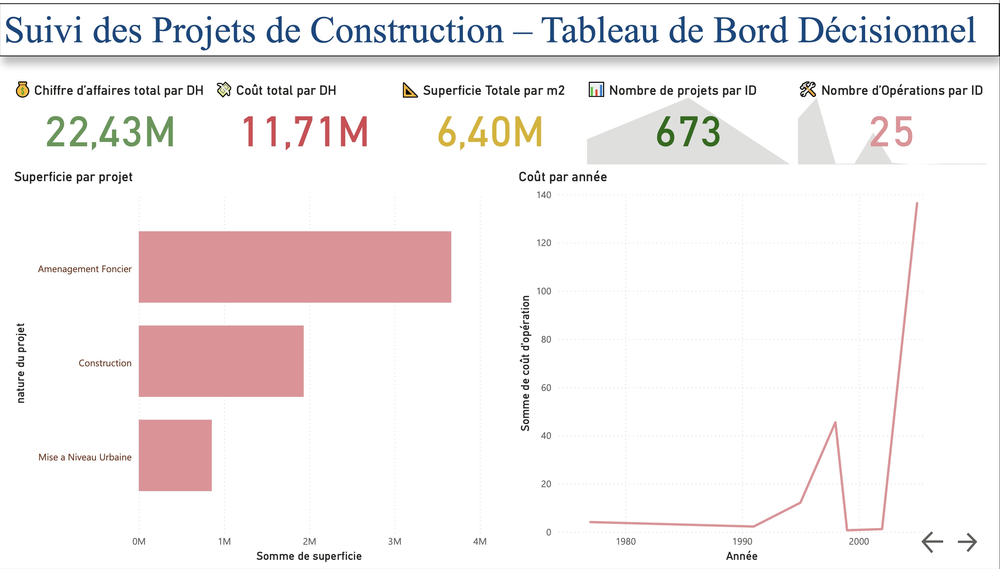
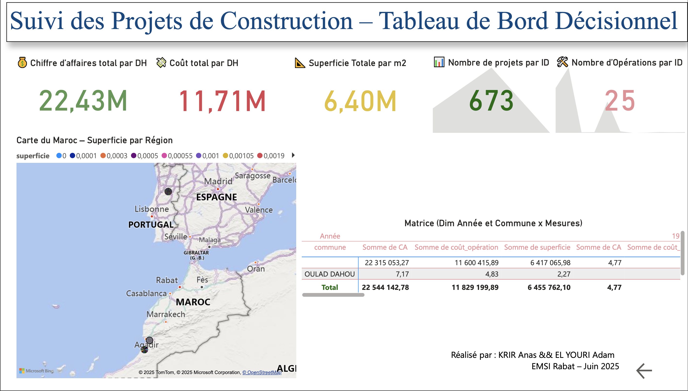

# 🏗️ DW-Construction — Tableau de bord BI pour le suivi des travaux d’une société de construction


Projet Business Intelligence permettant d’analyser les **chantiers, budgets, coûts, surfaces et régions**, à travers un **modèle en étoile (Data Warehouse)** et un **dashboard Power BI interactif**.

📊 Indicateurs clés suivis :
- Chiffre d’affaires total
- Coût global des opérations
- Superficie totale construite
- Nombre total de projets
- Répartition par région, nature d’opération, date, etc.

---

## 📌 Sommaire

1. [Objectifs du projet](#-objectifs-du-projet)
2. [Stack technique](#-stack-technique)
3. [Modèle de données (Star Schema)](#-modèle-de-données-star-schema)
4. [Aperçu du dashboard](#-aperçu-du-dashboard)
5. [Ouverture du fichier .pbix](#-ouverture-du-fichier-pbix)
6. [Rapport PDF complet](#-rapport-pdf-complet)
7. [Auteurs](#-auteurs)
8. [Licence](#-licence)

---

## 🎯 Objectifs du projet

✔️ Centraliser les données de suivi des chantiers  
✔️ Construire un Data Warehouse propre et modélisé en étoile  
✔️ Créer un tableau de bord décisionnel Power BI  
✔️ Permettre une analyse par **période, région, type d’opération, surface, coûts**  
✔️ Faciliter la prise de décision stratégique (direction et reporting)

---

## 🛠️ Stack technique

| Composant | Technologie |
|-----------|-------------|
| Outil BI | **Power BI Service** |
| Modélisation | Star Schema (Snowflake simplifié) |
| Langage de mesures | **DAX** |
| ETL Source | Excel | 
| DWH | Modèle tabulaire Power BI |
| Visualisation | KPI, cartes, matrices, slicers |
| Export | PDF + images + .pbix |

---

## 🧱 Modèle de données (Star Schema)

📌 Fichier : `model/star_schema.png`

```
FactSuivi (CA, coût, superficie, ID_Date, ID_Projet, ID_Région, ID_Opération)
│
├── DimDate (Jour, Mois, Année)
├── DimProjet (Type / Nature du projet)
├── DimRégion (Commune, Province)
└── DimOpération (Nature des travaux)
```
---

🖼️ Aperçu du modèle :



---

## 📸 Aperçu du dashboard

| Page | Aperçu |
|------|--------|
| Accueil KPI |  |
| Analyse Régionale |  |
| Suivi des Projets |  |

---

## 🗂️ Ouverture du fichier `.pbix`

1. Télécharger Power BI Desktop : https://powerbi.microsoft.com/desktop/
2. Ouvrir :  `report/DASHBOARD.pbix`
3. (Optionnel) Modifier le modèle, les visuels ou les mesures DAX

---

## 📄 Rapport PDF complet

📌 Disponible ici :  
[`docs/RAPPORT_DWH.pdf`](docs/RAPPORT_DWH.pdf)

Ce document contient :  
✅ Cahier des charges  
✅ Description du besoin métier  
✅ Architecture DWH  
✅ Modèle en étoile  
✅ Captures du dashboard  
✅ Analyse des résultats

---

## 👥 Auteurs

| Nom | Rôle |
|-----|------|
| **Anas KRIR** | Modélisation DWH, Dashboard Power BI, Documentation |
| **Adam EL YOURI** | Collecte données, ETL, Validation métier |

---

## 📄 Licence

Projet sous licence MIT.  
✅ Libre d’utiliser, modifier, distribuer.

© 2025 — Anas KRIR & EL YOURI Adam

---
